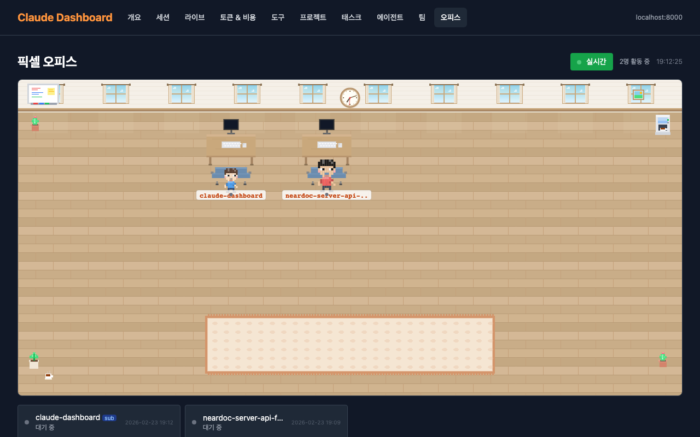

# Claude Dashboard

Claude Code가 `~/.claude/` 에 남기는 JSONL 세션 로그, 에이전트 정의, 팀/태스크 상태를 파싱하여 사용량 분석, 실시간 모니터링, 에이전트 리플레이를 제공하는 로컬 웹 대시보드.

## Security Notice

이 대시보드는 **localhost 전용**으로 설계되었습니다. `~/.claude/` 디렉토리의 세션 로그(대화 내용 포함)를 인증 없이 표시하므로, `0.0.0.0`이나 외부 네트워크에 바인딩하지 마세요.

## Quick Start

```bash
uv sync
uv run uvicorn main:app --reload --host 127.0.0.1 --port 8000
```

http://localhost:8000 에서 확인.

## Pages

| Route | 설명 |
|---|---|
| `/` | 총 세션/메시지/비용 카드, 최장 세션, 일별 활동 차트, 모델별 파이 차트, 시간대별 히트맵 |
| `/sessions` | 세션 목록 (검색, 페이지네이션), 프로젝트/브랜치/모델 표시 |
| `/sessions/{id}` | 대화 흐름, 메시지별 토큰, 도구 호출 상세, **SSE 실시간 메시지 tailing** |
| `/live` | SSE 기반 전체 프로젝트 실시간 이벤트 스트림 |
| `/tokens` | 일별 토큰 차트, 캐시 효율 게이지, 모델별 비용 테이블 |
| `/tools` | 도구 사용 빈도 바 차트, 세션별 도구 사용량 |
| `/projects` | 프로젝트별 세션/메시지/비용 비교 |
| `/tasks` | Claude Code 태스크 리스트 조회, 활성 팀 목록 |
| `/agents` | 에이전트 정의/호출 통계/도구 사용 분석, 최근 활동 |
| `/teams` | 팀 세션 목록, 에이전트 구성 |
| `/teams/replay/{id}` | 멀티 에이전트 세션 타임라인 리플레이 |
| `/pixel-office` | **픽셀 오피스** — 활성 에이전트를 픽셀 아트 캐릭터로 실시간 시각화 |

## Pixel Office

`/pixel-office` — 현재 활성 Claude Code 에이전트를 픽셀 아트 캐릭터로 가상 오피스에 시각화합니다. [pixel-agents](https://github.com/pablodelucca/pixel-agents) 프로젝트에서 영감을 받았습니다.



### 주요 기능

- **실시간 상태 감지**: JSONL tail-read + SSE(3초 간격)로 에이전트 상태를 실시간 반영
  - typing (코드 수정, 명령 실행), reading (파일/코드 검색), waiting (사용자 입력 대기), idle (유휴)
- **절차적 픽셀 아트 캐릭터**: 6가지 색상 팔레트, 16x16 스프라이트를 Canvas 2D로 렌더링 (외부 에셋 불필요)
- **걷기 애니메이션**: BFS pathfinding 기반 타일 이동, 5-phase 상태 머신 (SPAWN → WALK_TO_DESK → SEATED → WANDER → FADEOUT)
- **팀 파티션**: `~/.claude/teams/` 감지 시 팀원들을 파티션으로 그룹핑, 리드 에이전트 ★ 표시
- **서브에이전트 역할 표시**: 부모 JSONL에서 `subagent_type`/`name`을 추출하여 code-reviewer, Explore 등 역할명 표시
- **클릭 인터랙션**: 캐릭터 클릭 → 해당 세션 상세 페이지 이동, 호버 시 하이라이트
- **오피스 장식**: 밝은 마룻바닥, 크림색 벽, 창문(하늘/구름/커튼), 화분, 시계, 화이트보드, 카펫 등
- **상태별 말풍선**: 도구 상태 텍스트 + 페이드 애니메이션, waiting 시 "?" 표시

### 구성 파일

```
static/js/
├── pixel-office.js            # 메인 게임 엔진 (캐릭터, 렌더러, SSE 컨트롤러)
├── pixel-office-movement.js   # BFS pathfinding + 캐릭터 상태 머신
└── pixel-office-decorations.js # 오피스 장식 (화분, 시계, 카펫 등)

app/services/
└── pixel_agents_service.py    # JSONL 상태 감지, 팀 멤버 매칭, 서브에이전트 역할 추출
```

## Tech Stack

- **Backend**: Python 3.12+ / FastAPI / Jinja2
- **Frontend**: Tailwind CSS (CDN) / Chart.js (CDN) / HTMX
- **Real-time**: SSE (Server-Sent Events) + FileWatcher (offset 기반 incremental read)
- **Data**: `~/.claude/projects/**/*.jsonl` 직접 파싱 + `~/.claude/stats-cache.json`
- **Package**: uv
- **No DB, No build step** — JSONL 직접 읽기 + CDN 기반

## Project Structure

```
claude-dashboard/
├── main.py                          # FastAPI entry point
├── pyproject.toml
├── app/
│   ├── config.py                    # 경로, 모델별 API 가격, KST 변환
│   ├── models/
│   │   └── schemas.py               # Frozen dataclasses (Message, SessionInfo, LiveEvent 등)
│   ├── services/
│   │   ├── cache.py                 # TTL 인메모리 캐시 데코레이터 (30초)
│   │   ├── log_parser.py            # JSONL 스트림 파서, parse_session_full 단일 패스 파싱
│   │   ├── file_watcher.py          # FileWatcher (전체), SingleFileWatcher (단일 파일) — SSE용
│   │   ├── stats_service.py         # stats-cache.json 기반 Overview 집계
│   │   ├── session_service.py       # 세션 목록/상세/검색, find_session_file
│   │   ├── token_service.py         # 토큰/비용 분석
│   │   ├── tool_service.py          # 도구 사용 분석
│   │   ├── project_service.py       # 프로젝트별 분석
│   │   ├── agent_service.py         # 에이전트 정의 파싱, 서브에이전트 활동, 팀 세션, 리플레이
│   │   ├── task_service.py          # 태스크 리스트/팀 상태 파싱
│   │   └── pixel_agents_service.py  # 픽셀 오피스: 에이전트 상태 감지, 팀/서브에이전트 역할
│   ├── routers/
│   │   ├── overview.py              # GET /
│   │   ├── sessions.py              # GET /sessions, /sessions/{id}, /sessions/{id}/stream (SSE)
│   │   ├── live.py                  # GET /live, /live/stream (SSE)
│   │   ├── tokens.py                # GET /tokens
│   │   ├── tools.py                 # GET /tools
│   │   ├── projects.py              # GET /projects
│   │   ├── tasks.py                 # GET /tasks
│   │   ├── agents.py                # GET /agents
│   │   ├── teams.py                 # GET /teams, /teams/replay/{id}
│   │   └── pixel_office.py          # GET /pixel-office, /pixel-office/stream (SSE)
│   └── templates/
│       ├── base.html                # 공통 레이아웃 (nav, CDN 링크, HTMX beforeSwap)
│       ├── overview.html
│       ├── sessions.html
│       ├── session_detail.html      # SSE EventSource로 실시간 메시지 tailing
│       ├── live.html                # SSE EventSource로 실시간 이벤트 스트림
│       ├── tokens.html
│       ├── tools.html
│       ├── projects.html
│       ├── tasks.html
│       ├── agents.html
│       ├── teams.html
│       ├── replay.html              # 멀티 에이전트 타임라인 리플레이
│       ├── pixel_office.html        # 픽셀 오피스 (Canvas 2D)
│       ├── partials/                # HTMX 폴링용 부분 템플릿
│       └── components/
│           ├── nav.html
│           └── stats_card.html
├── static/
│   └── js/
│       ├── charts.js                # Chart.js 헬퍼 (line, bar, doughnut, horizontal bar)
│       ├── pixel-office.js          # 픽셀 오피스 메인 엔진 (캐릭터, 렌더러, SSE)
│       ├── pixel-office-movement.js # BFS pathfinding + 상태 머신
│       └── pixel-office-decorations.js # 오피스 장식 렌더링
└── tests/
    ├── test_log_parser.py
    ├── test_config.py
    ├── test_session_service.py
    ├── test_session_stream.py
    ├── test_file_watcher.py
    ├── test_agent_service.py
    ├── test_task_service.py
    ├── test_pixel_agents_service.py  # 픽셀 오피스 서비스 테스트
    └── test_pixel_office_router.py   # 픽셀 오피스 라우터 테스트
```

## Data Sources

**`~/.claude/stats-cache.json`** — Overview 페이지용 사전 집계 데이터 (일별 활동, 모델별 토큰, 시간대별 세션 수, 최장 세션).

**`~/.claude/projects/<project>/<session>.jsonl`** — 세션별 전체 대화 로그. 주요 메시지 타입:

| type | 주요 필드 | 용도 |
|---|---|---|
| `user` | `message.content` | 사용자 입력 |
| `assistant` | `message.model`, `message.usage`, `message.content[]` | Claude 응답 + 토큰 + 도구 호출 |
| `system` | `subtype`, `durationMs` | 턴 소요 시간 등 시스템 이벤트 |

**`~/.claude/agents/*.md`** — 에이전트 정의 파일 (YAML frontmatter + 마크다운).

**`~/.claude/teams/<team>/config.json`** — 활성 팀 구성 (멤버, 역할).

**`~/.claude/tasks/<team>/*.json`** — 태스크 리스트 (상태, 의존성, 담당자).

## Real-time Update

- **HTMX 폴링**: 모든 페이지에서 `hx-trigger="every 30s"`로 부분 템플릿 자동 갱신
- **SSE 스트리밍**: `/live/stream`, `/sessions/{id}/stream`, `/pixel-office/stream`에서 EventSource로 실시간 이벤트 수신
  - `FileWatcher`: 전체 프로젝트 디렉토리 감시 (라이브 페이지)
  - `SingleFileWatcher`: 단일 세션 파일 감시, `init_at_end()`로 SSR 이후 새 메시지만 감지
  - `pixel_agents_service`: JSONL tail-read로 에이전트 상태 감지 (픽셀 오피스, 5초 TTL)

## Cost Calculation

`app/config.py`에 정의된 모델별 가격 기준 (per 1M tokens):

| Model | Input | Output | Cache Read | Cache Creation |
|---|---|---|---|---|
| Opus 4.6 | $15 | $75 | $1.50 | $18.75 |
| Opus 4.5 | $15 | $75 | $1.50 | $18.75 |
| Sonnet 4.5 | $3 | $15 | $0.30 | $3.75 |
| Haiku 4.5 | $0.80 | $4 | $0.08 | $1.00 |

## Commands

```bash
# 의존성 설치
uv sync

# 서버 실행 (hot reload)
uv run uvicorn main:app --reload --port 8000

# 테스트
uv run pytest tests/ -v
```
